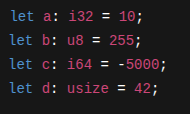
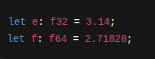
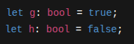
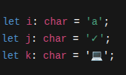
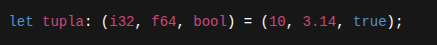
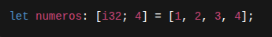
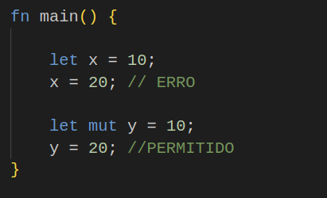
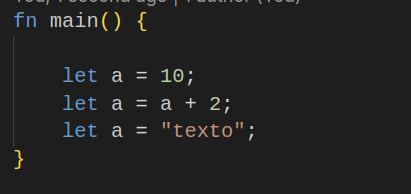
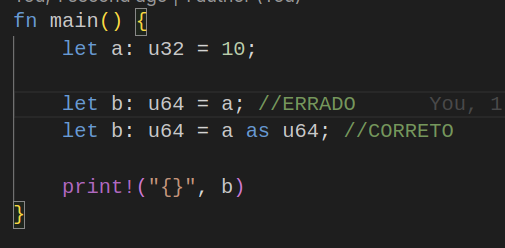

# Roadmap de Estudos Rust – 30 Dias  
Início: **22/11/2025**  
Término: **21/12/2025**  
Carga diária: **3h de estudo**
---

## SUMÁRIO
- [Semana 1 — Fundamentos](#semana-1--fundamentos)
- [Semana 2 — Estruturas e Erros](#semana-2--estruturas-e-erros)
- [Semana 3 — Rust Moderno](#semana-3--rust-moderno)
- [Semana 4 — Dioxus + WASM](#semana-4--dioxus--wasm)
- [Desafio Final](#desafio-final)

---

# Semana 1 — Fundamentos

## **22/11 – 23/11 — Instalação, Ferramentas e Primeiros Programas**
**Conteúdo:**
- Instalar Rust (rustup)
- Usar `cargo`
- Entender a estrutura de um projeto
- Criar e rodar programas simples

---

## **24/11 — Sistema de Tipos**
**Conteúdo:**
### Tipos escalares:
<figure>
  <figcaption>INT</figcaption>
  
</figure>
<figure>
  <figcaption>FLOAT</figcaption>
  
</figure>
<figure>
  <figcaption>BOOL</figcaption>
  
</figure>
<figure>
  <figcaption>CHAR</figcaption>
  
</figure>

### Tipos compostos
<figure>
  <figcaption>TUPLA</figcaption>
  
</figure>
<figure>
  <figcaption>ARRAY</figcaption>
  
</figure>

### Sombras e mutabilidade
<figure>
  <figcaption>MUTABILIDADE</figcaption>
  
</figure>

<figure>
  <figcaption>SOMBAS (SHADOW)</figcaption>
  
</figure>
### Conversões

<figure>
  <figcaption>Conversões</figcaption>
  
</figure>
---

## **25/11 — Ownership**
**Conteúdo:**
- Conceito de ownership
- Movimentos de valores
- Escopo e liberação automática

---

## **26/11 — Borrowing e Referências**
**Conteúdo:**
- Empréstimos mutáveis e imutáveis
- Regras do borrow checker
- Referências penduradas

---

## **27/11 — Slices e Strings**
**Conteúdo:**
- `&str` x `String`
- Slices
- Métodos essenciais de `String`

---

## **28/11 – 29/11 — Funções, Módulos e Organização**
**Conteúdo:**
- Declaração de funções
- Retorno implícito
- Módulos (`mod`, `pub`)
- Organização de pastas

---

# Semana 2 — Estruturas e Erros

## **30/11 — Structs e Métodos**
**Conteúdo:**
- Structs nomeadas
- Tuples structs
- `impl` e métodos

---

## **01/12 — Enums & Pattern Matching**
**Conteúdo:**
- Criar enums
- Usar `match`
- `if let` e `while let`

---

## **02/12 — Result, Option e Tratamento de Erros**
**Conteúdo:**
- Uso de `Result<T, E>`
- Propagação de erros (`?`)
- Erros recuperáveis x não recuperáveis

---

## **03/12 — Coleções**
**Conteúdo:**
- `Vec`
- `HashMap`
- `HashSet`
- Iteração e manipulação

---

## **04/12 — Iteradores e Closures**
**Conteúdo:**
- Sistema de iteradores
- Métodos como `map`, `filter`, `fold`
- Closures

---

## **05/12 – 06/12 — Lifetimes (Essencial)**
**Conteúdo:**
- Por que lifetimes existem
- Sintaxe `'a`
- Regras básicas

---

# Semana 3 — Rust Moderno

## **07/12 — Async/Await**
**Conteúdo:**
- Futures
- Runtime `tokio`
- Funções assíncronas

---

## **08/12 — Manipulação de Arquivos**
**Conteúdo:**
- Ler arquivos
- Escrever arquivos
- Tratar erros de IO

---

## **09/12 — HTTP Client**
**Conteúdo:**
- Usar `reqwest`
- GET e POST
- Tratamento de erros

---

## **10/12 — Concurrency**
**Conteúdo:**
- `tokio::spawn`
- `Arc`, `Mutex`
- Concorrência vs paralelismo

---

## **11/12 – 12/12 — Projeto Prático CLI**
**Objetivo:**
- Criar CLI que acessa API
- Ler e armazenar dados
- Tratar erros corretamente

---

# Semana 4 — Dioxus + WASM

## **13/12 — Introdução ao Dioxus**
**Conteúdo:**
- Componentes
- Props
- Estado

---

## **14/12 — Renderização e Eventos**
**Conteúdo:**
- Hooks (`use_state`)
- Inputs e eventos
- Estrutura do projeto

---

## **15/12 — Dioxus Desktop (Tauri)**
**Conteúdo:**
- Compilar app desktop
- Configuração inicial

---

## **16/12 — Dioxus Web (WASM)**
**Conteúdo:**
- Toolchain WASM
- Compilação
- Considerações de uso

---

## **17/12 — Roteamento**
**Conteúdo:**
- `dioxus-router`
- Páginas e parâmetros

---

## **18/12 – 19/12 — Projeto Dioxus**
**Objetivo:**
- Formulário
- Lista
- API simulada
- Navegação entre páginas

---

# **20/12 — Revisão Geral**
- Ownership
- Borrowing
- Result e Option
- Async

---

# **21/12 — Desafio Final**
Criar um pequeno app Dioxus com:
- Roteamento
- Estado
- Chamada HTTP real
- Build Web e Desktop

---

